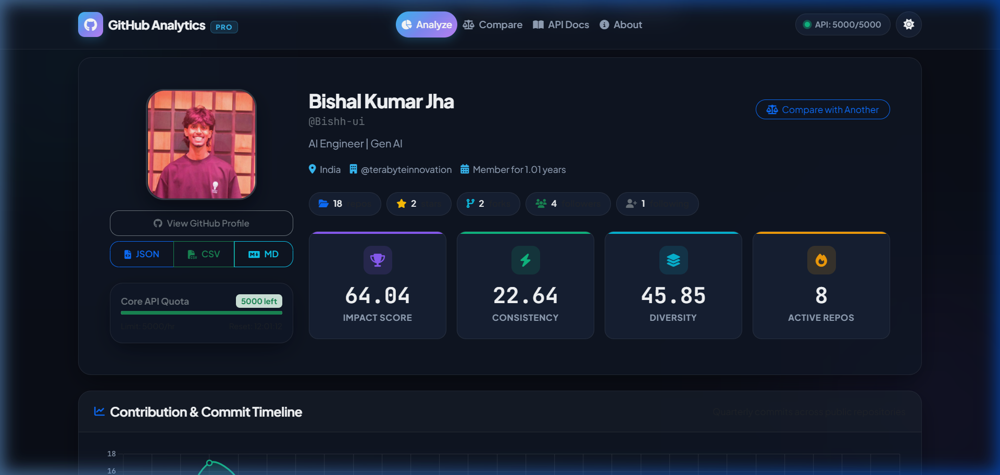
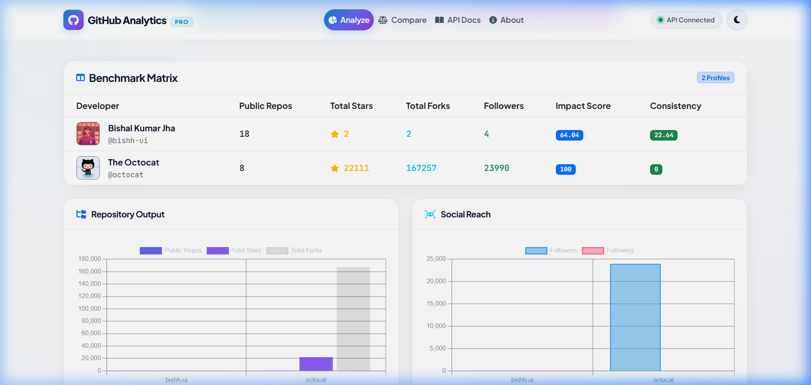

<div align="center">

# 🚀 GitHub Analytics Pro

### *Intelligent Developer Insights • Multi-Profile Comparison • Language DNA*

[](https://www.python.org/)
[](https://flask.palletsprojects.com/)
[](https://www.chartjs.org/)
[](LICENSE)
[](https://github.com)

<br>

<p align="center">
  <a href="https://vercel.com/new/clone?repository-url=https%3A%2F%2Fgithub.com%2FBishh-ui%2FGithub_analyzer&env=GITHUB_TOKEN,SECRET_KEY&project-name=github-analytics-pro">
    
  </a>
</p>

<p align="center">
  
</p>

<p align="center">
  <b>GitHub Analytics Pro</b> is a high-performance web platform that turns raw GitHub activity into actionable developer intelligence. Analyze repository impact, visualize programming language distribution, track contribution timelines, and benchmark engineers side-by-side.
</p>

[Key Features](#-key-features) •
[Quick Start](#-quick-start) •
[Project Structure](#-project-structure) •
[API Reference](#-api-reference) •
[Documentation](#-documentation) •
[Push to GitHub](#-push-to-github)

</div>

---

## ✨ Key Features

### 📊 Executive Developer Scorecards
- **Impact Score**: Composite rating synthesizing repository stars, forks, commit frequency, and follower engagement.
- **Consistency Index**: Measures regularity and momentum of contributions over quarters.
- **Language Diversity**: Evaluates technical versatility and multi-language proficiency.
- **Active Repositories**: Highlights repositories updated within the last 90 days.

### 📈 Dynamic Visualizations
- **Contribution Timeline**: Interactive cubic Bezier spline with gradient area fill tracking quarterly commit volume.
- **Language DNA**: Triple doughnut visualization breaking down languages by **Repositories**, **Stars**, and **Commits**.
- **Top Repositories Tabs**: Instant sorting by Stars, Forks, or Activity Score with language tags and direct links.
- **Collaboration & Code Quality Indicators**: Live gauges for follower ratios, social reach, repository topic coverage, and documentation health scores.

### 👥 Head-to-Head Comparison Engine
- Benchmark up to **5 GitHub developers simultaneously**.
- Side-by-side **Benchmark Matrix** comparing public repositories, stars, forks, followers, and impact scores.
- Interactive **radar and comparison charts** for social reach and stack diversity.

### ⚡ Developer-First Experience
- **Live Autocomplete Search**: Debounced username search with user avatars and repository counters.
- **1-Click Quick Chips**: Quick-analyze popular profiles (`@bishh-ui`, `@octocat`, `@torvalds`, `@gvanrossum`).
- **Direct URL Linking**: Share direct profile links with `/?username=<handle>`.
- **Multi-Format Export**: Instant client-side download to **JSON**, **CSV**, or **Markdown**.
- **Fluid Dark / Light Theme**: Glassmorphic UI with seamless Chart.js palette synchronization.
- **Real-Time API Monitor**: Continuous rate-limit tracking in the navigation bar.

---

## 📸 Preview Gallery

| Profile Dashboard | Benchmark Comparison |
| :---: | :---: |
|  |  |

---

## 🛠️ Tech Stack

- **Backend**: Python 3.8+, Flask 3.0, PyGithub 2.2, SQLAlchemy (SQLite/PostgreSQL), Flask-Caching, Flask-Limiter, Flask-CORS.
- **Frontend**: Vanilla Modern CSS (Design System Tokens, Glassmorphism, CSS Variables), JavaScript (ES6+), Bootstrap 5.3, FontAwesome 6.
- **Visualizations**: Chart.js 4.4 (Responsive canvases, linear gradients, custom tooltips).
- **Typography**: Google Fonts (*Plus Jakarta Sans* & *JetBrains Mono*).

---

## 📁 Project Structure

```
Git_Hub_analy/
├── api/                        # Vercel serverless entry point
│   └── index.py                # Serverless WSGI wrapper for Vercel
├── app/                        # Core Flask application package
│   ├── __init__.py             # Application factory & extension registration
│   ├── config/                 # Environment & app configuration
│   │   └── config.py           # Configuration loader (reads .env)
│   ├── models/                 # SQLAlchemy database models
│   │   ├── __init__.py
│   │   └── user_analytics.py   # Historical tracking & snapshot models
│   ├── routes/                 # Blueprint controllers
│   │   ├── github_routes.py    # Main web & comparison views
│   │   ├── api_routes.py       # RESTful API endpoints
│   │   └── export_routes.py    # JSON, CSV, and Markdown export endpoints
│   ├── services/               # API wrappers and scoring logic
│   │   ├── advanced_github_service.py # Core analytics & scoring engine
│   │   └── github_service.py   # Base GitHub service
│   └── templates/              # Modern Jinja2 templates
│       ├── base.html           # Glassmorphic base layout with navbar & footer
│       ├── index.html          # Main dashboard, hero search & scorecards
│       ├── compare.html        # Multi-user benchmark matrix & comparison
│       ├── docs.html           # Interactive API documentation
│       └── about.html          # Platform overview & metrics breakdown
├── docs/                       # Project guides & technical documentation
│   ├── DEPLOYMENT.md           # Production deployment (Vercel, Render, Heroku)
│   ├── FEATURES.md             # In-depth breakdown of 150+ metrics
│   ├── LOCAL_SETUP.md          # Local machine step-by-step setup
│   ├── QUICK_START.md          # Fast onboarding guide
│   ├── UPGRADE_GUIDE.md        # Architecture & migration notes
│   ├── CHANGELOG.md            # Release history
│   ├── SSL_TROUBLESHOOTING.md  # Windows SSL & certifi fallback notes
│   └── archive/                # Diagnostic history and troubleshooting logs
├── img/                        # High-resolution README preview screenshots
│   ├── Screenshot.png          # Primary dashboard preview
│   ├── compare_preview.png     # Comparison matrix screenshot
│   └── homepage_preview.png    # Homepage hero screenshot
├── instance/                   # Local SQLite database (gitignored)
├── scripts/                    # Diagnostic & maintenance utilities
│   ├── check_rate_limit.py     # Check remaining GitHub API requests & token
│   ├── setup_local.py          # Environment verification & database initializer
│   └── test_ssl.py             # SSL connectivity & API verification
├── static/                     # Web assets
│   ├── css/                    # Modern stylesheets (enhanced.css, style.css)
│   └── js/                     # Client logic (app.js, charts.js, compare.js, enhanced.js, theme.js)
├── .env.example                # Safe environment template
├── .gitignore                  # Comprehensive git exclusion rules
├── LICENSE                     # MIT License
├── Procfile                    # Cloud deployment process file
├── requirements.txt            # Python dependencies
├── run.py                      # Application entry point (`python run.py`)
├── runtime.txt                 # Python runtime version
├── start.bat                   # Windows 1-click start script
└── vercel.json                 # Vercel serverless deployment config
```

---

## 🚀 Quick Start

### 1. Prerequisites
- **Python 3.8+** installed on your system.
- A **GitHub Personal Access Token** ([Generate here](https://github.com/settings/tokens) with scopes `read:user`, `public_repo`, `read:org`).

### 2. Clone and Setup Environment

```bash
# Clone repository
git clone https://github.com/yourusername/github-analytics-pro.git
cd github-analytics-pro

# Create virtual environment
python -m venv venv

# Activate virtual environment
# Windows:
venv\Scripts\activate
# macOS/Linux:
source venv/bin/activate

# Install dependencies
pip install -r requirements.txt
```

### 3. Configure Environment Variables

Copy `.env.example` to `.env`:

```bash
cp .env.example .env
```

Open `.env` and add your GitHub token:

```env
GITHUB_TOKEN=your_github_personal_access_token_here
DEBUG=True
SECRET_KEY=dev_secret_key_change_in_production
DATABASE_URL=sqlite:///github_analytics.db
CACHE_TYPE=simple
```

### 4. Verify & Run

Verify your setup with our built-in diagnostic tools:

```bash
# Check GitHub API rate limit & token
python scripts/check_rate_limit.py

# Verify local dependencies & initialize database
python scripts/setup_local.py

# Launch development server
python run.py
```

> **Windows Users**: You can also double-click **`start.bat`** to launch the server instantly!

Visit **[http://localhost:5000](http://localhost:5000)** in your browser.

---

## 🧰 Diagnostic Utilities

Pre-configured scripts are located in `scripts/`:

| Command | Purpose |
| :--- | :--- |
| `python scripts/check_rate_limit.py` | Displays current authenticated rate limit (5,000 req/hr) and reset time |
| `python scripts/test_ssl.py` | Verifies SSL certificates, fallback mechanisms, and GitHub connectivity |
| `python scripts/setup_local.py` | Tests all Python packages, checks `.env`, and creates SQLite tables |

---

## 🌐 API Reference

GitHub Analytics Pro exposes a comprehensive RESTful JSON API:

| Method | Endpoint | Description |
| :--- | :--- | :--- |
| `GET` | `/api/user/<username>` | Comprehensive stats, scores, language distribution, and top repos |
| `GET` | `/api/user/<username>/history` | Historical analytics snapshots (query param `days=90`) |
| `POST` | `/api/compare` | Multi-user comparison (JSON body: `{"usernames": ["user1", "user2"]}`) |
| `GET` | `/api/search/users?q=<query>` | Live GitHub user autocomplete search |
| `GET` | `/api/rate-limit` | Real-time Core and Search API quota status |
| `GET` | `/export/json/<username>` | Download raw analytics JSON |
| `GET` | `/export/csv/<username>` | Download tabular repository CSV |
| `GET` | `/export/markdown/<username>` | Download formatted Markdown report |

#### Example Request:
```bash
curl http://localhost:5000/api/user/octocat
```

---

## 📚 Documentation

Detailed architectural and deployment guides are available in [`docs/`](docs/):

- 📖 **[Quick Start Guide](docs/QUICK_START.md)** – Fast setup and feature walkthrough.
- 💻 **[Local Development Guide](docs/LOCAL_SETUP.md)** – Comprehensive local installation.
- 🌟 **[Features Breakdown](docs/FEATURES.md)** – Complete technical details on scoring algorithms.
- 🚀 **[Deployment Guide](docs/DEPLOYMENT.md)** – Step-by-step production setup on Render, Heroku, and AWS.
- 🔄 **[Upgrade Guide](docs/UPGRADE_GUIDE.md)** – Platform evolution and database schema history.
- 🔒 **[SSL Troubleshooting](docs/SSL_TROUBLESHOOTING.md)** – SSL certificate validation troubleshooting.
- 📝 **[Changelog](docs/CHANGELOG.md)** – Version history and release notes.

---

## 📤 Push to GitHub

To push this clean repository to your GitHub account:

```bash
# 1. Initialize git repository (if not already done)
git init

# 2. Stage all files (sensitive files like .env and databases are automatically ignored by .gitignore)
git add .

# 3. Create your initial commit
git commit -m "feat: initial commit of GitHub Analytics Pro with clean structure and modern UI"

# 4. Set default branch to main
git branch -M main

# 5. Link to your GitHub repository (replace with your repo URL)
git remote add origin https://github.com/yourusername/github-analytics-pro.git

# 6. Push to GitHub
git push -u origin main
```

---

## 📝 License

This project is licensed under the **MIT License** - see the [LICENSE](LICENSE) file for details.

---

## 👨‍💻 Author & Acknowledgments

- **Bishal Kumar Jha** ([@bishh-ui](https://github.com/bishh-ui))
- Built with ❤️ using [Flask](https://flask.palletsprojects.com/), [PyGithub](https://github.com/PyGithub/PyGithub), and [Chart.js](https://www.chartjs.org/).

<div align="center">
  <sub>⭐ If you find GitHub Analytics Pro useful, don't forget to star the repository! ⭐</sub>
</div>
